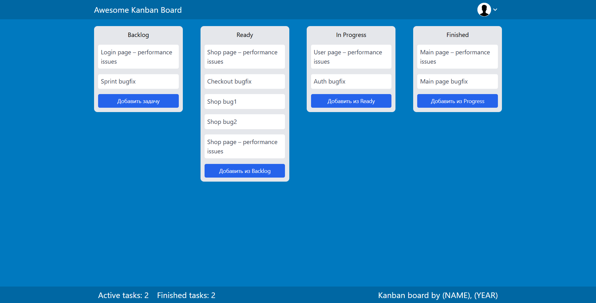

# Task Tracker

Task Tracker — это простое приложение для управления задачами в формате Kanban Board, разработанное на React.

Проект позволяет перемещать задачи между этапами выполнения:

- Backlog
- Ready
- In Progress
- Finished

## Preview


### Desktop



### Mobile

.png)

---

## Design Reference

This project was developed based on the following Figma design:

👉 [Kanban Board Design (Figma)](https://www.figma.com/design/gmwg0Me1T6szwVqd7KSYL6/Kanban?node-id=1-2&t=9l7YiGxwXlZjzb7w-0)

The goal of the project was to practice:

- Converting a Figma design into a real application
- Component-based architecture in React
- State management with React Hooks
- Responsive layout development
- Client-side routing with React Router

## Features

- Просмотр задач по статусам
- Добавление новых задач
- Перемещение задач между колонками
- Отслеживание количества активных и завершённых задач
- Адаптивный интерфейс
- Маршрутизация между страницами задач
- Выпадающее меню профиля

---

## Technologies

- React
- React Router DOM
- Tailwind CSS
- JavaScript (ES6+)

---

## Project Structure

```text
src/
│
├── components/
│   ├── Header.jsx
│   ├── Footer.jsx
│   ├── Layout.jsx
│   │
│   └── tack-tracker/
│       ├── Backlog.jsx
│       ├── Ready.jsx
│       ├── InProgress.jsx
│       ├── Finished.jsx
│       ├── Card.jsx
│       ├── Task.jsx
│       ├── ProfileMenu.jsx
│       └── index.jsx
│
├── App.jsx
├── index.jsx
└── App.css
```

---

## Installation

### Clone repository

```bash
git clone https://github.com/YOUR_USERNAME/task-tracker.git
```

### Go to project directory

```bash
cd task-tracker
```

### Install dependencies

```bash
npm install
```

### Run development server

```bash
npm start
```

Application will be available at:

```text
http://localhost:3000
```

---

## Available Scripts

### Start project

```bash
npm start
```

### Build production version

```bash
npm run build
```

### Run tests

```bash
npm test
```

---

## Future Improvements

- Drag & Drop between columns
- Data persistence using Local Storage
- User authentication
- Dark mode
- Backend integration
- Task editing and deleting

---

## Author

GitHub: https://github.com/YOUR_USERNAME

Created as a learning project for practicing React, React Router and state management.